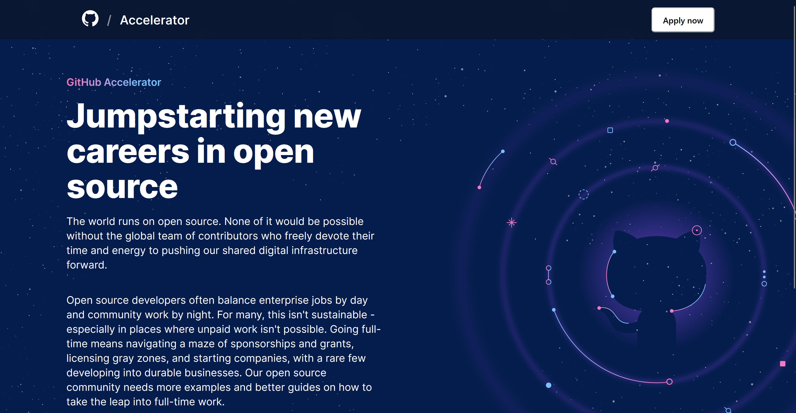
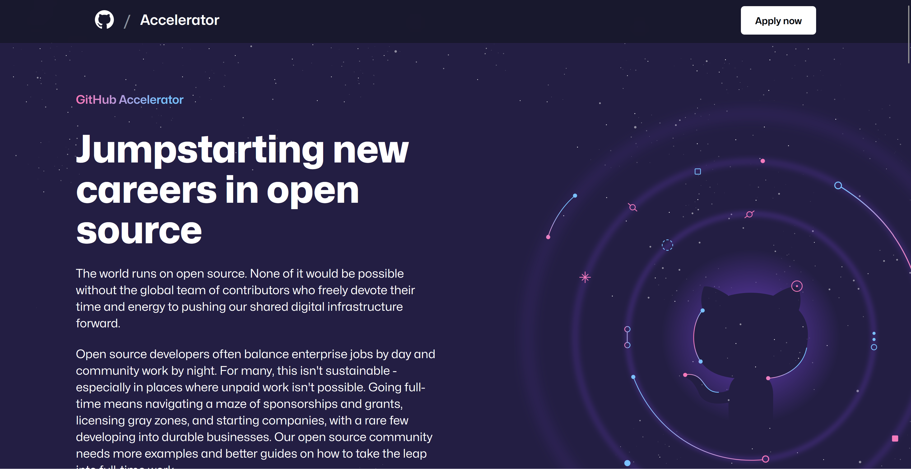
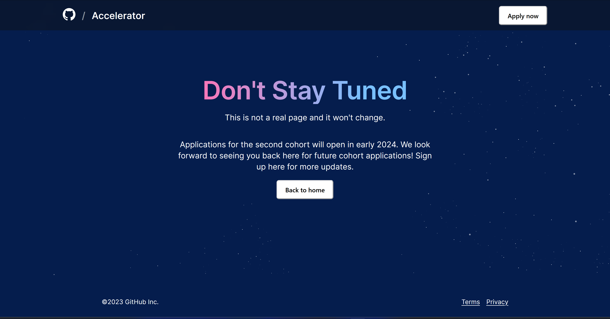
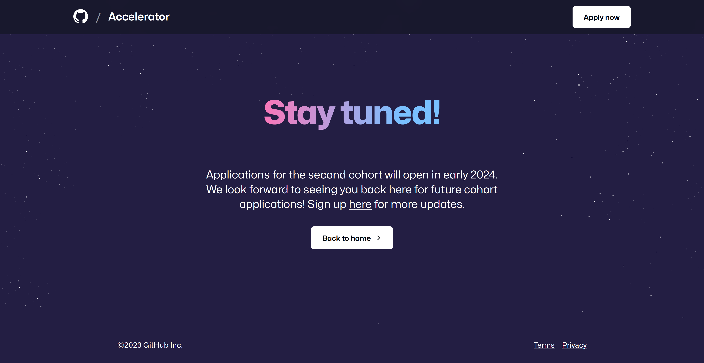
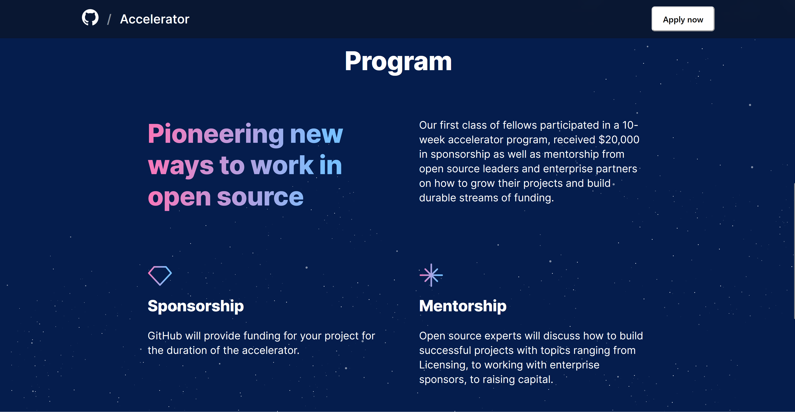
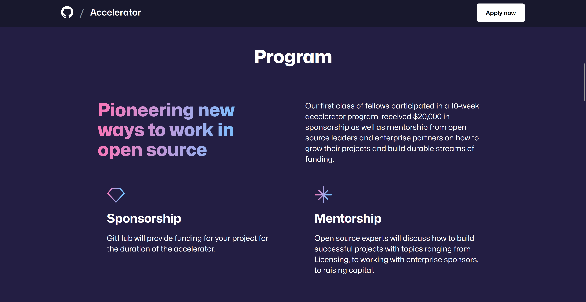

# Clone of the GitHub Accelerator Page using Next.js

### Goal
The goal of the project was to gain more experience creating dynamic applications with Next.js. The excersise was to replicate the website https://accelerator.github.com/application.

### Outcomes
1. I initially started the project with Tailwind CSS, but I removed it entirely seeing how messy it made my code. In addition, I also needed to add custom css stuff for all the fancy styling I stole from the GitHub page, and so Tailwind did not save me from writing css as much as I thought.
2. The page is not an exact replica as there are a few px difference in a few components but it's definately good enough. 

I made mine in a blue background rather than purple to make te comparisons more obvious. See them below:

Mine            |  Theirs
:-------------------------:|:-------------------------:
 | 
 | 
 | 

## Developing

First, run the development server:
```
npm run dev
```
Open http://localhost:3000 with your browser to see the result.

You can start editing the page by modifying app/page.tsx. The page auto-updates as you edit the file.

This project uses next/font to automatically optimize and load Inter, a custom Google Font.